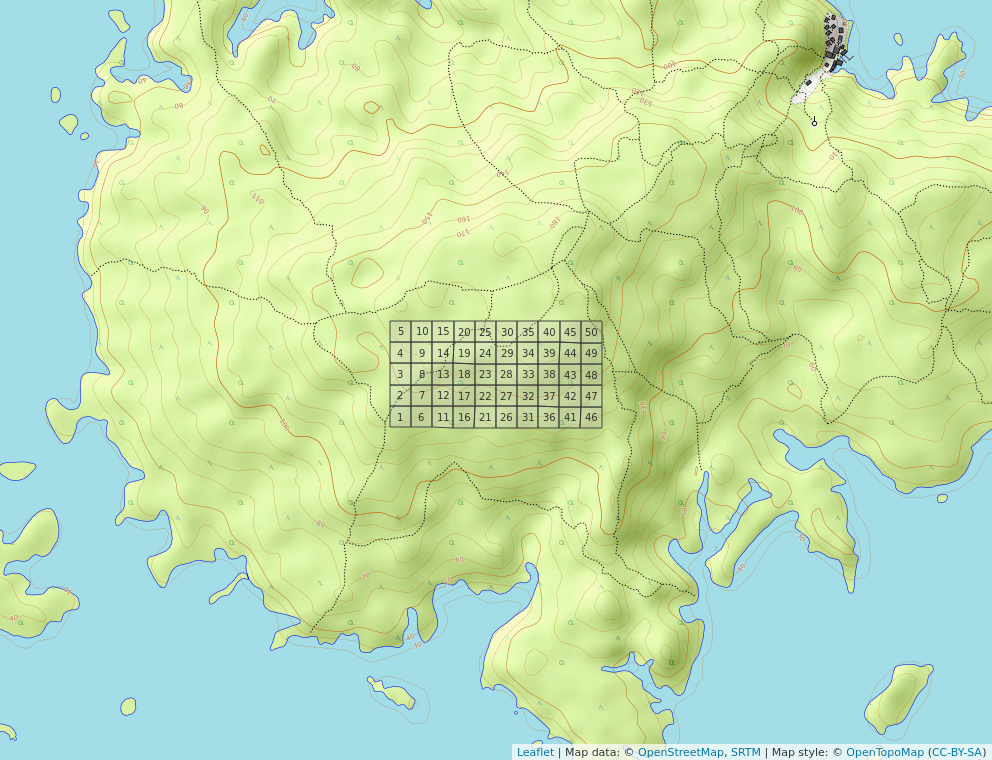

# Introducción

Desde mediados del siglo XVII es posible visualizar el interés del hombre a estudiar la flora, la fauna y el medio en el que están en conjunto con las interacciones que se producen entre ellos, pero no es hasta mediados del siglo XIX cuando se introduce el término Ecología y su definición, que se empieza a englobar en este tipo de estudios en una categoría [@de2003ecologia]. A partir de este punto se reconocieron distintos campos de estudios y se implementaron nuevos métodos de análisis, entre los cuales destacan la ecología numérica y métodos como el análisis multivariático. Según @legendre2012numerical, la ecología numérica no es más que una de las disciplinas de la ecología cuantitativa, la cual a la vez es una de las divisiones de la ecología matemática. 

La ecología numérica se concentra en el estudio y análisis de conjuntos de datos ecológicos, a fin de poder detallar y comprender la configuración de los conjuntos de datos, combinando diversas perspectivas numéricas y disciplinas, procedentes de la Geografía, las matemáticas físicas, taxonomía numérica, parámetros estadísticos y otros más [@legendre2012numerical]. El análisis de conjuntos de datos ecológicos, especialmente de la flora, resulta importante tanto para la ciencia, como para la economía o el sector de salud, por eso se han establecido distintas parcelas permanentes de medición y monitoreo forestal donde se colectan datos sobre la diversidad forestal, su estructura, el crecimiento y su productividad [@pineda2014analisis]. En el estudio de las plantas a través de la Ecología Numérica se usan diversas técnicas que permiten obtener información sobre el rango de asociación, agrupamiento, ordenamiento, diversidad, autocorrelación, etcétera, diferentes herramientas para usar las técnicas.

La medición de la asociación es un coeficiente que sirve para medir y asociar los datos de variables cualitativos y cuantitativos. La medición de estas variables se puede hacer por dos modos el *Q* y el *R*, el primero consiste en hacer una comparación de un dúo de objetos y el segundo consiste en realizar una descripción de un par de objetos y luego compararlos. Para el modo *Q* se miden la asociación según la similaridad o disimilaridad de un par de objetos. Mientras que para el modo R se mide el grado de dependencia existente entre las variables, entre los cuales se puede mencionar la covarianza o el coeficiente de correlación [@borcard2011numerical].

En cambio, el análisis de agrupamiento o clúster análisis es una técnica que consiste en separar un conjunto de datos y luego estructurarlos, sin dejar uno fuera de lugar, como subconjuntos con distintas categorías o jerarquías de acuerdo a sus características. La finalidad de hacer un agrupamiento es identificar los pequeños grupos dispersos en un espacio discreto pero constante, este agrupamiento divide en conjunto de objetos a estudiar, por lo que es necesario e importante que cada objeto agrupado en otros subgrupos no se encuentre en otros [@borcard2011numerical].

En el caso del análisis de ordenamiento, son técnicas que consisten en simplificar la magnitud de los datos. Todas estas técnicas muestran las predisposiciones esenciales de variabilidad de cada dato que se encuentran en un campo de dimensiones simplificadas, organizando los ejes con rangos decreciente de varianza explicada en cada uno de los ejes sucesivo, de forma convencional. Estos tipos de análisis pueden ser tanto no restringido o simple, como restringido o canónico. En donde para el primero, las tendencias o predisposiciones del grupo que interesa no está restringida por otro grupo. Entre sus técnicas principales de análisis están los de componentes principales (*PCA*) basado en un vector propio y se utiliza en datos cuantitativos sin tratamiento preservando la distancia euclídea, los de correspondencia (*CA*) que se usa en datos frecuentes con dimensiones uniformes y positivos, y los de coordenadas principales (*PCoA*) que se concentra en organizar las matrices de disimilaridad, usualmente, con el modo *Q* en vez de tablas de sitio por variables [@borcard2011numerical]. 

Mientras que, para el segundo análisis de ordenamiento, restringido o canónico, a diferencia de la simple, es una técnica que relaciona dos o más conjunto de datos en el proceso de organización u ordenación. Algunas de sus técnicas principales son análisis de redundancia (*RDA*) que consiste en la combinación de la regresión y *PCA* que funciona como una extensión de diversos análisis que muestran la respuesta multivariante de datos, y el análisis de correspondencia canónica (*CCA*) que funciona como un aproximado de una regresión Gaussiana multivariante, además, este se caracteriza por organizar las especies en todos los ejes canónicos acore a su configuración ecológica óptima [@borcard2011numerical].

En cuanto a la diversidad, según @borcard2011numerical y @magurran1988ecological, esto alude a la variedad y cantidad de especies en un espacio determinado, esta variedad también se produce a nivel de comunidad. La diversidad puede La diversidad va desde la diversidad local, hasta heterogeneidad espacial de esta diversidad. La diversidad de especies considerada como un número único puede ser medida por la riqueza o la rarificación de especies usando la notación q o por la presencia o ausencia de los datos de esta. Según @whittaker1972evolution, el entendimiento de la diversidad y los cambios que conllevan, asociados a la configuración del relieve los componentes *alpha*, *beta* y *gamma* serian de mucha utilidad. Donde la primera se refiere a la riqueza de las especies existentes en una comunidad determinada, considerada homogénea. La segunda, se trata del rango de cambios que se producen en la estructura de especies que están en diferentes comunidades en un espacio. Y la última, se refiere a la riqueza de especies de forma conjuntiva que hay en una comunidad y que integra un espacio determinado.

La autocorrelación, según @borcard2011numerical, forma parte de los análisis espaciales aplicados a datos ecológicos, que se produce por distintos procesos y que mide puntos cercanos para afirmar si estos poseen valores similares o distintos, por lo que la correlación puede ser una correlación positiva o negativa.

La *Myrtaceae* son una familia de plantas de árboles y arbustos bastante numerosas compuestas caracterizadas por ser leñosas. Esta familia de plantas pertenece al orden de los *Myrtales*, teniendo a nivel mundial 129 géneros y aproximadamente 5330 especies [@pereztree]. De sus características físicas se destacan sus hojas simples y opuestas, tienden a ser perennes por lo que resulta poco común ver individuos caducifolios, sus flores son hermafroditas y comúnmente son de color blanco con simetría radial, según la especie de esta familia los frutos tienen forma de bayas o cápsulas secas. De esta familia el género más conocido es el *Eucalypto Eucalyptus* por sus propiedades medicinales y su madera dura. Esta familia está distribuida en todos los continentes, pero predominan en América, África y Oceanía, en climas templados, tropicales y subtropicales. Muchos consideran que la importancia de esta familia está en lo económico, como la producción de frutas para venta de zumos y mermeladas, producción de madera, producción de papel, de carbón, además de ser usadas en la industria farmacéutica, se usa en la cosmetología y en la producción de especias [@josemyrtaceae; @encymyrtaceae; @sandra2019myrtaceae].

El estudio de la biodiversidad de la flora en especial de una especie vegetal es importante, debido a que permite conocer sus características propias, ecosistémicas, su distribución, su capacidad productiva, su potencial de uso y aportes a los humanos como a su ecosistema. Por todo lo anterior, es importante determinar el objetivo de este estudio, el cual se fragmenta así: *a)* identificar si los grupos de mi familia, *Myrtaceae*, se organizan de forma discontinua y acorde a la composición de las especies; *b)* indagar si existe algún tipo de patrón que sea o no sea consistente con alguna variable ambiental o atributo; *c)* determinar cuántas especies indicadoras hay o si hay alguna con preferencia por ciertas condiciones ambientales o atributos; *d)* investigar, en un espacio bidimensional, si hay una tendencia de ordenación visible de las especies de Myrtaceae; *e)* conocer si las tendencias de ordenación se asocian con las variables ambientales o atributos; *f)* determinar, de acuerdo a la estimación de riqueza, si mi familia está bien representada, tomando como buena representación un 85%; *g)* investigar si existe una alguna asociación entre la diversidad Alpha y las variables ambientales o atributos y cuales son estas; *h)* conocer si hay algún tipo de contribución local o de alguna especie a la diversidad Beta; *i)* identificar si hay alguna especie que presente algún patrón aglomerado, cuál es y si presenta alguna asociación con las variables ambientales; *j)* y determinar si los modelos de distribución de especies (*SDM*) predicen adecuadamente las ocurrencias de las especies. 
 
# Área de estudio

El área usada para este estudio se encuentra en *BCI* (Isla de Barrio Colorado), que es una isla perteneciente a Panamá, la cual se formó cuando las aguas del río Chagres fueron represadas para construir el Canal de Panamá. Es considerada como una colina con una superficie de 1,500 hectáreas sobresaliente a 137 m en el lago Gatún, y que está localizada entre los 9$^\circ$ 09’ N y 79$^\circ$ 51’ W. Esta isla se caracteriza por sus suelos arcillosos con profundidades entre los 50 cm y 1 m, y su clima es común de las tierras bajas tropicales con temperatura promedio anual de 27$^\circ$ C, y variación diurna de 9$^\circ$ C. También tiene unas precipitaciones anuales de 2,600 mm, con su estación lluviosa (mayo a diciembre), y su estación seca para el resto de meses [@perez2005metodologia; @sugasti2018medicion]. Según la clasificación de  zonas de vida de Holdridge, BCI se encuentra ubicada en la zona de vida de bosque húmedo tropical; @claver1984guia, dice que conforme a la clasificación de climática de Köppen esta tiene un clima tropical húmedo con precipitaciones abundantes; y de acuerdo con el mapa de  la ANAM (2000) su vegetación se caracteriza por tener bosques semicaducifolio tropical de tierras bajas [@rodriguez2021colonizacion].
 
El área de estudio, específicamente, es una parcela permanente forestal para su medición y monitoreo de 50 hectáreas, establecida en 1980 por Stephen Hubbell y Robin Foster, en el bosque húmedo tropical de *BCI*. Esta parcela se caracteriza por su forma rectangular  con 1000 m de largo y 400 m de ancho, además, esta se ubica en la parte cental de una meseta en la isla [@Hubbell2005barro; @perez2005metodologia]. 
Los datos extraidos de las especies forestales de la parcela se obtuvieron a tráves de multiples censos desde 1982 hasta 2015 (un total de 8 censos), en los cuales se hicieron identificación, marcado y monitoreo de los tallos leñosos individuales de más de 10 mm de diámetro a altura del pecho. Durante los 35 años se censarón más de 350,000 árboles individuales [@Hubbell2005barro]. Ver figura \ref{fig:bci_map}

{width=100%}

# Metodología y materiales

Para el estudio de la biodiversidead de la familia *Myrtaceae* se usaron los datos censales de las 50 parcelas forestales de *BCI* que están presentes en el repositorio `scripts-de-analisis-BCI` [@jose_ramon_martinez_batlle_2020_4402362], de los cuales fueron tratados y procesados con distintos algoritmos y técnicas de medición, cálculo, análisis e interpretación por medio del entorno de desarrollo intregado y libre, *RStudio* [@R2020ALanguage]. En cuanto a los gráficos presentes se obtuvieron por medio *R*, usando paquetes y funciones (ver tabla\ref{tab:materiales}). 

Para inciar los análisis estadísticos de datos con dimensiones diversas, @buzai2009analisis y @borcard2011numerical, recomiendan realizar un análisis exploratorio de datos (EDA), debido a que es una herramienta imprescindible  para conseguir, con una primera inmediación, información genérica  de los datos, realizar transformaciones a variables de ser necesarias, y poder conducir más análisis. Se usaron los paquetes `vegan`, `tidyverse`, `sf`, `mapview` y `RColorBrewer` para cargar los datos censales, matriz de comunidad y matriz ambiental, y así poder extraer los datos de la familia *Myrtaceae*, de las variables ambientales y transformarlos en tablas, matrices, e incluso generar gráficos de mapas. También, se usaron las librerías `psych` y `ez`, en conjunto con las anteriores para ver correlaciones de la *Myrtaceae* con distintas variables ambientales con la función `cor`, y generar mapas de variables ambientales por cada cuadro con `ggplot2`.

La mediada de los coeficientes de asociación de la familia *Myrtacea* con los modos *Q* y *R* fue mediante las librerias `vegan`, `adespatial`, `broom`, `tidyverse`, `sf`, `cluster` y `gclus`. Para medir 

# Resultados
Ver tabla \ref{tab:abun_sp} y figura \ref{fig:abun_sp_q}

# Discusión

# Agradecimientos

# Información de soporte

|      Materiales      	|                                                              Uso                                                              	|
|:--------------------:	|:-----------------------------------------------------------------------------------------------------------------------------:	|
|        RStudio       	|           Redacción del manuscrito, procesamientos de datos censales de la familia *Myrtaceae* por medio de Scripts.          	|
|     library vegan    	|        Conjunto de herramientas para hacer análisis de diversidad, ordenación de comunidad y análisis de disimilaridad.       	|
|  library tidiyverse  	|             Colección de paquetes que permiten transformar, importar, visualizar, modelar y presentar distintos datos.            	|
|      library sf      	|      Creación de simple features, ampliando objetos tipo data.frame con una columna de lista de características simples.      	|
|    library mapview   	|                              Para ver objetos espaciales de forma interactiva sobre un mapa base.                             	|
| library RColorBrewer 	|                                      Para crear paletas de colores para mapas temáticos.                                      	|
|      library ez      	|                  Permiten una visualización y análisis de datos simples y con especificaciones consistentes.                  	|
|     library psych    	|                              Conjunto de herramientas para hacer análisis de datos multivariados.                             	|
|     library tmap     	|                           Para visualizar, con mapas temáticos, la distribución de datos espaciales.                          	|
|  library adespatial  	|                    Herramienta para hacer análisis espaciales, a distintas escalas, de datos multivariados.                   	|
|     library broom    	|                                  Para resumir información de objetos estadísticos en tablas.                                  	|
|    library cluster   	|                      Para el clúster análisis o de agrupamiento, que permiten encontrar grupos de datos.                      	|
|     library gclus    	|                Ordena en matrices de diagramas, dispersión y coordenadas paralelas con un índice, los paneles.                	|
|    library magittr   	|                      Paquete que permite, mediante mecanismos, cadenas de comandos con el operador pipa.                      	|
|    library pvclust   	| Paquete que permite implementar un remuestreo multiescala para evaluar inconsistencia en análisis de agrupamiento jerárquico. 	|
| library indicspecies 	|                   Estima el valor estadístico de la relación presencia-abundancia de especies y sus sitios.                   	|
|     library plyr     	|     Conjunto de herramientas que permiten separar, aplicar y combinar datos para generar resúmenes estadísticos de ellos.     	|
| library SpadeR       	| Estima diversos índices de biodiversidad y medidas de similitud de datos individuales tomados de diversas comunidades.        	|
| library iNEXT        	| Paquete que permite calcular y trazar la rarefacción y extrapolación de diversidad de especies.                               	|
| library vegetarian   	| Para calcular la diversidad por comunidad en un conjunto de datos.                                                            	|
| library ape          	| Paquete que permite hacer análisis filogenéticos y evolutivos de árboles.                                                     	|
| library spdep        	| Conjunto de funciones para crear matrices de ponderaciones espaciales de puntos de patrones polígonos, entre otros.           	|
| library ade4         	| Herramientas para análisis de datos multivariados.                                                                            	|
| library adegraphics  	| Sirve para hacer representaciones gráficas de datos multivariados.                                                            	|
| library gridExtra    	| Ofrece funciones para poder trabajar con gráficos en *grid* y crear diversos trazados en una página y dibujar tablas.         	|
| library grid         	| Reescribe los gráficos, sus capacidades y da soporte a la interacción.                                                        	|
| library gtable       	| Herramientas que permiten trabajar más fácil con tablas.                                                                      	|
Table: \label{tab:materiales} Materiales usados en el estudio

# *Script* reproducible

\ldots

# Referencias
