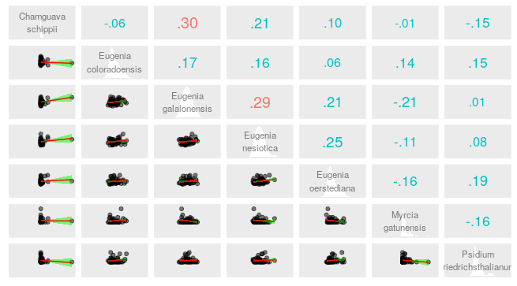
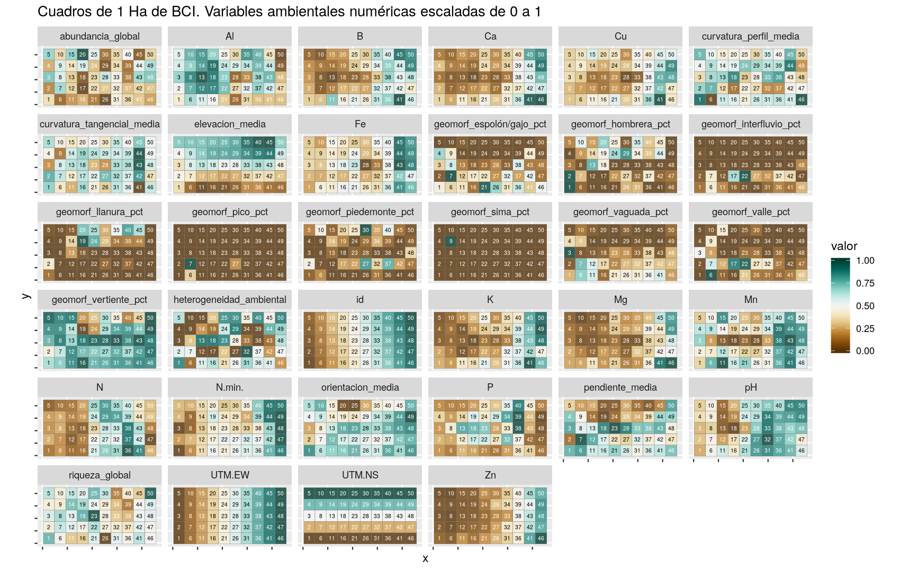
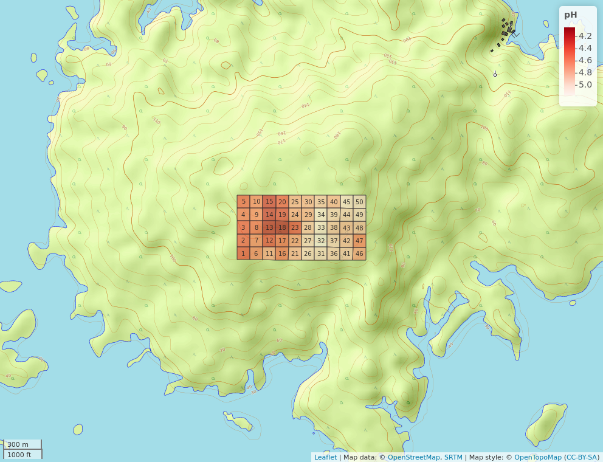
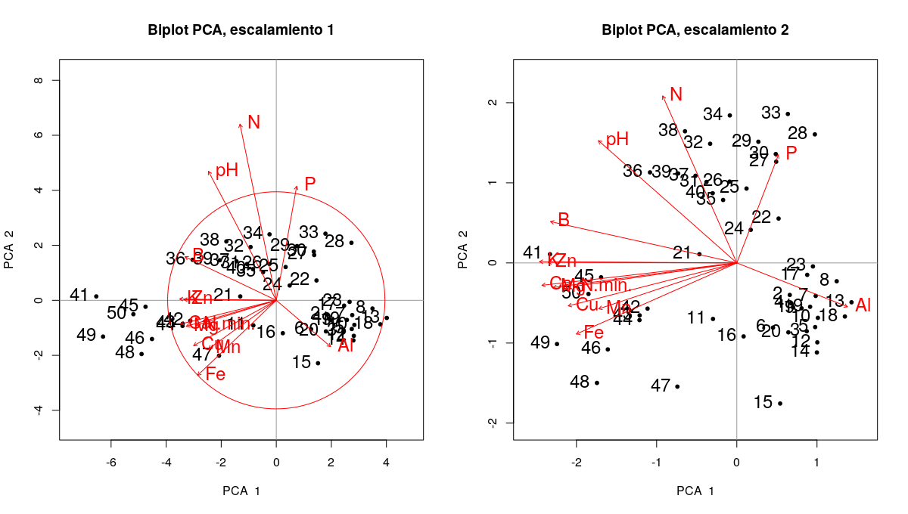

# Introducción

Desde mediados del siglo XVII es posible visualizar el interés del hombre a estudiar la flora, la fauna y el medio en el que están en conjunto con las interacciones que se producen entre ellos, pero no es hasta mediados del siglo XIX cuando se introduce el término Ecología y su definición, que se empieza a englobar en este tipo de estudios en una categoría [@de2003ecologia]. A partir de este punto se reconocieron distintos campos de estudios y se implementaron nuevos métodos de análisis, entre los cuales destacan la ecología numérica y métodos como el análisis multivariático. Según @legendre2012numerical, la ecología numérica no es más que una de las disciplinas de la ecología cuantitativa, la cual a la vez es una de las divisiones de la ecología matemática. 

La ecología numérica se concentra en el estudio y análisis de conjuntos de datos ecológicos, a fin de poder detallar y comprender la configuración de los conjuntos de datos, combinando diversas perspectivas numéricas y disciplinas, procedentes de la Geografía, las matemáticas físicas, taxonomía numérica, parámetros estadísticos y otros más [@legendre2012numerical]. El análisis de conjuntos de datos ecológicos, especialmente de la flora, resulta importante tanto para la ciencia, como para la economía o el sector de salud, por eso se han establecido distintas parcelas permanentes de medición y monitoreo forestal donde se colectan datos sobre la diversidad forestal, su estructura, el crecimiento y su productividad [@pineda2014analisis]. En el estudio de las plantas a través de la Ecología Numérica se usan diversas técnicas que permiten obtener información sobre el rango de asociación, agrupamiento, ordenamiento, diversidad, autocorrelación, etcétera.

La medición de la asociación es un coeficiente que sirve para medir y asociar los datos de variables cualitativos y cuantitativos. La medición de estas variables se puede hacer por dos modos el *Q* y el *R*, el primero consiste en hacer una comparación de un dúo de objetos y el segundo consiste en realizar una descripción de un par de objetos y luego compararlos. Para el modo *Q* se miden la asociación según la similitud o disimilitud de un par de objetos. Mientras que para el modo R se mide el grado de dependencia existente entre las variables, entre los cuales se puede mencionar la covarianza o el coeficiente de correlación [@borcard2011numerical].

En cambio, el análisis de agrupamiento o clúster análisis es una técnica que consiste en separar un conjunto de datos y luego estructurarlos, sin dejar uno fuera de lugar, como subconjuntos con distintas categorías o jerarquías de acuerdo a sus características. La finalidad de hacer un agrupamiento es identificar los pequeños grupos dispersos en un espacio discreto pero constante, este agrupamiento divide un conjunto de objetos a estudiar, por lo que es necesario e importante que cada objeto agrupado en otros subgrupos no se encuentre en otros [@borcard2011numerical].

En el caso del análisis de ordenamiento, son técnicas que consisten en simplificar la magnitud de los datos. Todas estas técnicas muestran las predisposiciones esenciales de variabilidad de cada dato que se encuentran en un campo de dimensiones simplificadas, organizando los ejes con rangos decreciente de varianza explicada en cada uno de los ejes sucesivo, de forma convencional. Estos tipos de análisis pueden ser tanto no restringido o simple, como restringido o canónico. En donde para el primero, las tendencias o predisposiciones del grupo que interesa no está restringida por otro grupo. Entre sus técnicas principales de análisis están los de componentes principales (*PCA*) basado en un vector propio y se utiliza en datos cuantitativos sin tratamiento preservando la distancia euclídea, los de correspondencia (*CA*) que se usa en datos frecuentes con dimensiones uniformes y positivos, y los de coordenadas principales (*PCoA*) que se concentra en organizar las matrices de disimilaridad, usualmente, con el modo *Q* en vez de tablas de sitio por variables [@borcard2011numerical]. 

Mientras que, para el segundo análisis de ordenamiento, restringido o canónico, a diferencia de la simple, es una técnica que relaciona dos o más conjunto de datos en el proceso de organización u ordenación. Algunas de sus técnicas principales son análisis de redundancia (*RDA*) que consiste en la combinación de la regresión y *PCA* que funciona como una extensión de diversos análisis que muestran la respuesta multivariante de datos, y el análisis de correspondencia canónica (*CCA*) que funciona como un aproximado de una regresión Gaussiana multivariante, además, este se caracteriza por organizar las especies en todos los ejes canónicos acorde a su configuración ecológica óptima [@borcard2011numerical].

En cuanto a la diversidad, según @borcard2011numerical y @magurran1988ecological, esto alude a la variedad y cantidad de especies en un espacio determinado, esta variedad también se produce a nivel de comunidad. La diversidad va desde la diversidad local, hasta heterogeneidad espacial de la misma. La diversidad de especies es considerada como un número único puede ser medido por la riqueza o la rarificación de especies usando la notación q o por la presencia o ausencia de los datos de esta. Según @whittaker1972evolution, el entendimiento de la diversidad y los cambios que conllevan, asociados a la configuración del relieve los componentes *alpha*, *beta* y *gamma* serian de mucha utilidad. Donde la primera se refiere a la riqueza de las especies existentes en una comunidad determinada, considerada homogénea. La segunda, se trata del rango de cambios que se producen en la estructura de especies que están en diferentes comunidades en un espacio. Y la última, se refiere a la riqueza de especies de forma conjuntiva que hay en una comunidad y que integra un espacio determinado.

La autocorrelación, según @borcard2011numerical, forma parte de los análisis espaciales aplicados a datos ecológicos, que se produce por distintos procesos y que mide puntos cercanos para afirmar si estos poseen valores similares o distintos, por lo que la correlación puede ser tanto positiva como negativa.

La *Myrtaceae* son una familia de plantas de árboles y arbustos bastante numerosas, caracterizadas por ser leñosas. Esta familia de plantas pertenece al orden de los *Myrtales*, teniendo a nivel mundial 129 géneros y aproximadamente 5330 especies; en Panamá 17 géneros y 72 especies; y en Barro Colorado 6 géneros y 15 especies, de las cuales hay 4 géneros y 7 especies (ver tabla \ref{tab:genero}) en la parcela de medición permanente [@pereztree; @smithss2021spec]. De sus características físicas se destacan sus hojas simples y opuestas, tienden a ser perennes por lo que resulta poco común ver individuos caducifolios, sus flores son hermafroditas y comúnmente son de color blanco con simetría radial, según la especie de esta familia los frutos tienen forma de bayas o cápsulas secas. De esta familia el género más conocido es el *Eucalypto Eucalyptus* por sus propiedades medicinales y su madera dura. Esta familia está distribuida en todos los continentes, pero predominan en América, África y Oceanía, en climas templados, tropicales y subtropicales. Muchos consideran que la importancia de esta familia está en lo económico, como la producción de frutas para venta de zumos y mermeladas, producción de madera, producción de papel, de carbón, además de ser usadas en la industria farmacéutica, se usa en la cosmetología y en la producción de especias [@josemyrtaceae; @encymyrtaceae; @sandra2019myrtaceae].

El estudio de la biodiversidad de la flora en especial de una especie vegetal es importante, debido a que permite conocer sus características propias, ecosistémicas, su distribución, su capacidad productiva, su potencial de uso y aportes a los humanos como a su ecosistema. Por todo lo anterior, es importante saber: si los grupos de mi familia, *Myrtaceae*, se organizan de forma discontinua y acorde a la composición de las especies; también, si existe algún tipo de patrón que sea o no sea consistente con alguna variable ambiental o atributo; del mismo modo, cuántas especies indicadoras hay o si hay alguna con preferencia por ciertas condiciones ambientales o atributos; de igual manera y en un espacio bidimensional, si hay una tendencia de ordenación visible de las especies de Myrtaceae; luego, determinar si las tendencias de ordenación se asocian con las variables ambientales o atributos; determinar, de acuerdo a la estimación de riqueza, si mi familia está bien representada, tomando como buena representación un 85%; asi mismo, si existe una alguna asociación entre la diversidad Alpha y las variables ambientales o atributos y cuales son estas; también, ver si hay algún tipo de contribución local o de alguna especie a la diversidad Beta; así también, saber si hay alguna especie que presente algún patrón aglomerado, cuál es y si presenta alguna asociación con las variables ambientales; y determinar si los modelos de distribución de especies (*SDM*) predicen adecuadamente las ocurrencias de las especies. 
 
# Área de estudio

El área usada para este estudio se encuentra en *BCI* (Isla de Barro Colorado), que es una isla perteneciente a Panamá, la cual se formó cuando las aguas del río Chagres fueron represadas para construir el Canal de Panamá. Es considerada como una colina con una superficie de 1,500 hectáreas sobresaliente a 137 m en el lago Gatún, y que está localizada entre los 9$^\circ$ 09’ N y 79$^\circ$ 51’ W. Esta isla se caracteriza por sus suelos arcillosos con profundidades entre los 50 cm y 1 m, y su clima es común de las tierras bajas tropicales con temperatura promedio anual de 27$^\circ$ C, y variación diurna de 9$^\circ$ C. También tiene unas precipitaciones anuales de 2,600 mm, con su estación lluviosa (mayo a diciembre), y su estación seca para el resto de los meses [@perez2005metodologia; @sugasti2018medicion]. Según la clasificación de zonas de vida de Holdridge, BCI se encuentra ubicada en la zona de vida de bosque húmedo tropical; @claver1984guia, dice que conforme a la clasificación de climática de Köppen esta tiene un clima tropical húmedo con precipitaciones abundantes; y de acuerdo con el mapa de la ANAM (2000) su vegetación se caracteriza por tener bosques semicaducifolio tropical de tierras bajas [@rodriguez2021colonizacion].
 
El área de estudio, específicamente, es una parcela permanente forestal para su medición y monitoreo de 50 hectáreas, establecida en 1980 por Stephen Hubbell y Robin Foster, en el bosque húmedo tropical de *BCI*. Esta parcela se caracteriza por su forma rectangular con 1000 m de largo y 400 m de ancho, además, esta se ubica en la parte central de una meseta en la isla [@Hubbell2005barro; @perez2005metodologia]. 
Los datos extraídos de las especies forestales de la parcela se obtuvieron a través de múltiples censos desde 1982 hasta 2015 (un total de 8 censos), en los cuales se hicieron identificación, marcado y monitoreo de los tallos leñosos individuales de más de 10 mm de diámetro a altura del pecho. Durante los 35 años se censaron más de 350,000 árboles individuales [@Hubbell2005barro]. Ver figura \ref{fig:bci_map}. 

{width=100%}


# Metodología y materiales

Para el estudio de la biodiversidad de la familia *Myrtaceae* se usaron los datos censales de las 50 parcelas forestales de *BCI* que están presentes en el repositorio `scripts-de-analisis-BCI` [@jose_ramon_martinez_batlle_2020_4402362], de los cuales fueron tratados y procesados con distintos algoritmos y técnicas de medición, cálculo, análisis e interpretación por medio del entorno de desarrollo integrado y libre, *RStudio* [@R2020ALanguage]. En cuanto a los gráficos presentes se obtuvieron por medio *R*, usando paquetes y funciones (ver tabla \ref{tab:materiales}). 

Para iniciar los análisis estadísticos de datos con dimensiones diversas, @buzai2009analisis y @borcard2011numerical, recomiendan realizar un análisis exploratorio de datos (EDA), debido a que es una herramienta imprescindible para conseguir una primera inmediación, información genérica de los datos, realizar transformaciones a variables de ser necesarias, y poder conducir más análisis. Se usaron los paquetes `vegan`, `tidyverse`, `sf`, `mapview` y `RColorBrewer` para cargar los datos censales, de matriz de comunidad y de matriz ambiental, y así poder extraer los datos de la familia *Myrtaceae* y de las variables ambientales para transformarlos en tablas, matrices, e incluso generar gráficos de mapas. También, se usaron las librerías `psych` y `ez`, en conjunto con las anteriores para ver correlaciones de la *Myrtaceae* con distintas variables ambientales con la función `cor`, y generar mapas de variables ambientales por cada cuadro con `ggplot2`.

La medida de los coeficientes de asociación de la familia *Myrtaceae* con los modos *Q* y *R* [@borcard2011numerical; @salazar2000coeficientes] se realizó mediante funciones pertenecientes a las librerias `vegan`, `adespatial`, `broom`, `tidyverse`, `sf`, `cluster` y `gclus`. En el modo *Q* se mide la abundancia de las especies de *Myrtaceae* con la función `dist.ldc` que calcula la distancia euclídea entre dos sitios y se usa también el método de transformación Hellinger  y así obtener el grado de disimilitud entre sitios. También, se calculó la distancia de *Jaccard* *Dj* [@jaccard1908nouvelles; @salazar2000coeficientes] utilizando la función `vegdist` que convierte la matriz de comunidad en una de presencia/ausencia para calcular la matriz de distancia. En cuanto a la asociación de las variables ambientales, se hizo un nuevo ambiente con la función `env` para las variables transformadas con la función `scale`. De igual manera, se usó la función `env_mix` para asociar las variables ambientales heterogeneidad ambiental, hábitat y quebrada, generando una matriz de disimilitud.

Con el modo *R* de medición de asociación, se mensuró el grado de asociación entre especies haciendo una transformación de la matriz de comunidad usando la estandarización *Chi* con la función `decostand`, luego se calcula la distancia con la función `dist` y se representa la matriz en un mapa de calor con la función `coldiss`. Se calculó la distancia de *Jaccard* [@jaccard1908nouvelles; @salazar2000coeficientes] entre especies usando la matriz de comunidad transpuesta convertida a una de presencia/ausencia con la función `vegdist`. En cuanto a la asociación de variables ambientales numéricas, se calculó usando el índice de *rho* de Spearman con los verbos `select`, `mutate` y `matches` de la herramienta `dplyr` y también la función `cor` para correlación.

Los análisis de agrupamiento o clúster análisis aplicados a la familia *Myrtaceae* fueron realizados usando las librerías `magrittr`, `broom`, `tidyverse`, `mapview` y `indicspecies`. Para el estudio se usó el agrupamiento jerárquico (*AJ*) con un enfoque aglomerativo por enlace simple, completo, promedio y el método de *Ward* de varianza mínima [@borcard2011numerical]. Se agruparon pares de objetos según la mayor similaridad (vecino más próximo o mínima distancia), partiendo del agrupamiento por enlace simple, utilizando la matriz de comunidad transformada por medio del método de normalización con la función `decostand` y la distancia euclídea con la función `vegdist`. El agrupamiento jerárquico se hizo con la función `hclust` para método simple y se generó un dendrograma (gráfico) con la función `plot` del resultado de este AJ. Para el agrupamiento completo usando la menor similaridad (máxima distancia o vecino más lejano) se empleó la función `hclust` y la matriz de distancia de cuerdas o *chord* [@borcard2011numerical], con tal de generar un dendrograma con la función `plot`. En cuanto al agrupamiento por enlace promedio (UPGMA, WPGMA, UPGMC, WPGMC), se usó el UPGMA [@romesburg2004cluster] para maximizar la correlación entre las distancias cofenética (coeficiente de correlación de Pearson), para esto se usó la función `hclust` y para obtener el gráfico la función `plot`. Finalmente, el agrupamiento por Ward [@romero2021propuesta], que define los grupos de una forma donde la suma de cuadrados se minimice en cada uno de ellos usando las funciones `hclust` y `plot`.

De todos los métodos anteriores de agrupamiento, se han seleccionado los métodos ideales para la familia *Myrtaceae* usando la función `map` y así se pudo comparar sus valores. Además, para la elección del número de clústeres se usó la función `calcular_anchuras_siluetas` en base a la matriz de comunidad original, la matriz de distancias y objeto de clúster usando UPGMA y Ward, luego, se hizo un nuevo dendrograma con la función `reorder.hclust` y un mapa de calor con la función `heatmap`. Finalmente, se hizo una evaluación para ver si el número de clústeres obtenidos por los métodos anteriores son los ideales usando el método *bootstrap* [@efron1992bootstrap; @tibshirani1993introduction], usando el paquete `pvclust` para generar dendogramas con trazos en rectángulos y líneas que dividen el gráfico acorde al número de grupos.

En cuanto al agrupamiento de variables se usaron los grupos obtenidos por UPGMA para evaluar la homogeneidad por medio de pruebas *t*, basadas en la distribución *t* de *Student* [@hurtado2012como] y la suma de rangos de Wilcoxon [@wilcoxon1964some], a partir de esto se generaron gráficos de caja y mapas presentando la ubicación por cuadrado de cada grupo en la parcela permanente. Y para la homogeneidad de los grupos Ward se usó el método ANOVA o análisis de varianza [@hurtado2012como] y Kruskal/Wallis [@kruskal1952use].

Cerrando con el clúster análisis, se obtuvieron las especies indicadoras y las especies con preferencias por hábitats; la primera mediante `IndVal` con las funciones `multipatt` y `strassoc` y su significancia o valor p con la función `p.adjust`; las especies con preferencias por hábitats se obtuvieron mediante el coeficiente de correlación biserial puntual [@palmer2000tutorial] con las funciones `multipatt` y `strassoc`.

Las técnicas de ordenación aplicas a las *Myrtaceae* usaron las librerías `vegan`, `tidyverse`, `sf` y `mapview`. Para la ordenación simple o no restringida se usaron las técnicas PCA, CA y PCoA. Con la función `rda` para escalar las variables, calcular la matriz de correlación y obtener vectores para PCA con datos ambientales, la función `screeplot` para graficar lo anterior y `cleanplot.pca` para el escalamiento; también, se hizo un mapa con puntuaciones de los sitios para tomarlas como coordenadas con las funciones `scores` y `plot`; para datos de comunidad transformada con *hellinger* se usaron las funciones `decostand`, `rda`, `screeplot` y `scores`, también, se evaluaron los datos de comunidad a datos ambientales con la función `envfit`. Para el análisis CA se usó las funciones `cca`, `screeplot` y `par`. Y para el análisis PCoA se usaron la función `cmdscale` y una matriz de distancias, también la función `ordiplot`.

En la ordenación canónica o restringida se usaron las técnicas RDA y CCA para presentar las relaciones entre los objetos (entre dos matrices) sin restricción. En la primera técnica, usando la matriz ambiental, se utilizaron la función `decostand`, `rda` para ajustar las variables de respuesta por regresión, haciendo prueba estadística para ver la relación de las variables de la matriz ambiental según el valor de *p*, también se calculó R2 insesgado con la función `RsquareAdj`, además de explorar la multicolinealidad entre variables. En cuanto a CCA, se usaron las mismas funciones, se excluyeron especies con abundancias mínimas al 100 por individuo.

En cuanto a la diversidad de la *Myrtaceae*, alpha y beta, para su cálculo se usaron las librerías `vegan`, `adespatial`, `plyr`, `RColorBrewer`, `tidyverse`, `sf`, `SpadeR`, `iNEXT`, `vegetarian` y `mapview`. Para calcular la diversidad especies, alpha, como un número único, se usó la función `alpha_div` y así obtener los índices alpha; tambien se usó la función `pairs` para hacer una matriz de correlación de Pearson con todos los índices, luego con la función `bind_cols` se unen en una matriz estos índices con variables ambientales. Para calcular el rango de abundancia de especies se usó la función `radfit`. Para la rarefacción por sitios se usó la función `specnumber`. Para el cálculo de abundancia por sitio se usó `rowSums`; se generó con una curva de rarefacción con los datos obtenidos anteriormente. De la misma manera, se calculó la riqueza de especies mediante estimaciones y comparaciones, para poder evaluar la completitud de muestra; para esto se usaron los enfoques asintóticos y no asintóticos (el primero para estimar riquezas de especies y el segundo para rarefacción y extrapolar), se calculó y se extrapoló la riqueza de especies con la función `specpool`; con la función `colSums` se hizo una matriz de comunidad combinando, con medias númericas, todos los sitios en uno, para estimar, con esta matriz, la riqueza con el índice *chao* [@chao2016species], la rarefacción y extrapolación de especies. 

También se aplicaron los enfoques asintóticos y no asintóticos para generar una matriz de comunidad agrupada según Ward usando los verbos `mutate` y `select` de `dplyr`; se estimó la riqueza y los porcentajes bajos y altos con la función `estimación_riqueza_chao`, también se obtuvieron los porcentajes de rarefacción y se extrapoló.
Y para calcular la diversidad beta con único número se usó la función `calcular_beta_multiplicativa`; también se determinó la contribución de especies y la contribución local a la diversidad beta con la función `determinar_contrib_local_y_especie`, con el método `hellinger` y un indicador alpha de 0.05.

Finalmente, se realizó la autocorrelación o análisis espacial ecológico usando las herramientas de las librerias `ape`, `spdep`, `ade4`, `adegraphics`, `adespatial`, `vegan`, `tidyverse`, `sf`, `gridEstra`, `grid`, y `gtable`. Se generó una matriz Hellinger con la función `decostand` y se transformó la matriz ambiental con el objeto `sp` para generar vecindad, del mismo modo se usó la función `nb2listw` para crear una lista de vecinos con pesos espaciales. También, se hizo una autocorrelación espacial por medio de correlograma de una sola variable ambiental con la función `sp.correlogram`; del mismo modo, se hizo una con múltiples variables con la matriz de Hellinger para conocer la abundancia de especies con la función `calcular_autocorrelacion` con el método de Moran's I. 

Además, se hizo una versión reversa de la matriz Hellinger con `rev` y luego se generaron gráficos con la función `par`. De igual manera, se hizo la autocorrelación para las variables ambientales con la función `calcular_autocorrelacion` y el método de Moran's I. Se hizo, también, una autocorrelación espacial por medio de la prueba de Mantel [@borcard2012mantel] o matrices de distancias a datos de comunidad con las funciones `resid`, `dist` y `mantel.correlog`. Se realizó una autocorrelación espacial mediante pruebas de permutación para el I de Moran, aplicado a abundancia de especies transformadas sin tendencia con `sapply` usando la función `mi_fam_sin_tendencia`; y aplicado a variables ambientales, se usó `sapply` con las funciones `var`, `gtable_filter` y `grid.arrange` para filtrar celdas por nombre de las variables ambientales; finalmente, se usó el mismo procedimiento aplicado a abundancias de especies transformadas y aplicado a abundancias de especies transformadas sin tendencias.


# Resultados
## Análisis Exploratorio de Datos (EDA)
La aplicación de los EDA en el estudio produjo informaciones generales sobre la familia *Myrtaceae*, sus especies, su abundancia, las variables ambientales, y datos generales de correlación con las variables ambientales.
La parcela de muestreo permanente (de ahora en adelante *pmp*) de 50 hectáreas en BCI tiene 5579 individuos (abundancia) pertenecientes a la familia *Myrtaceae* y una riqueza de 7 especies. Las especies que más destacan por su abundancia son las *Eugenia galalonensis* (1975 individuos) y *Eugenia oerstediana* (1838 individuos), en cambio, las especies con menor número de individuos en la parcela son *Myrcia gatunensis* (56 individuos) y *Psidium friedrichsthalianum* (50 individuos), ver tabla \ref{tab:specabu} y figuras \ref{fig:abumifam} y \ref{fig:riqmifam}.

|           Especies          	| Número      	|
|:---------------------------:	|:-----------:	|
|     Eugenia galalonensis    	|     1975    	|
|     Eugenia oerstediana     	|     1838    	|
|    Eugenia coloradoensis    	|     609     	|
|      Chamguava schippii     	|     541     	|
|      Eugenia nesiotica      	|     502     	|
| Psidium friedrichsthalianum 	|      58     	|
|      Myrcia gatunensis      	|      56     	|
Table: \label{tab:specabu} Abundancia por especies de la familia *Myrtaceae*

De acuerdo con los resúmenes estadístico el 50% de la abundancia de especies, según la mediana, es mayor de 541 individuos (*Chamguava schippii*) y la abundancia de especie promedio en *pmp* es de 797 individuos. En cuanto a la riqueza de la familia *Myrtaceae*, indica que el 50% de la riqueza, según la mediana, es de 6 especies y una riqueza promedio de 5.5, también hay que agregar que la riqueza mínima es de 4 especies en *pmp*. De igual manera, hay que mencionar que la riqueza y la abundancia varía por cuadro de 1h en *pmp*, arroja que los sitios con mayor riqueza son los cuadros 13, 14, 17, 22 y 40 (7), en cambio los de menor riqueza son los cuadros 2, 5, 11, 36, 46 y 47 (4); y los sitios con mayor abundancia fueron los cuadros 19, 20, 15, 40 y 38, y los de menor abundancia fueron los cuadros 1, 36, 30, 2 y 9; donde coinciden el sitio 40 con mayor riqueza y abundancia por cuadro, y los sitios 2 y 36 con menor riqueza y abundancia, lo que indica que existe una distribución aleatoria y desigual de las riquezas y abundancias en los sitios de *pmp* (ver figura \ref{fig:abuxcua}).
De las especies de *Myrtaceae* que presentan una correlación simple (de Pearson) positiva significativa, en comparación a las demás, están *Chamguava schippii* y *Eugenia galalonensis* con un índice de correlación de 0.30, también *Chamguava schippii* con *Eugenia nesiotica* con un índice de correlación de 0.29, por lo que estas especies tiene una relación con la otra (ver figura \ref{fig:corresp}).

En cuanto a las variables ambientales que se destacan en *pmp* están: la geológica, que de acuerdo con el Mapa geológico del canal de Panamá y sus alrededores [@stewart1980geologic] y los resultados de EDA la *pmp* se caracteriza, por sus rocas basalto, tipo intrusiva y extrusiva, del Mioceno medio y superior (Tb). También se caracteriza por tener hábitats de bosque viejo en relieve bajo en su mayoría al oeste de la parcela, en algunas partes del centro y al este de *pmp*; por sus hábitat de bosque viejo en relieve alto al centro y este de *pmp*; se agregan los bosques jóvenes de los sitios 30 y 35;  y los bosques de pendiente baja concentradas al este y con algunos sitios aleatorios en *pmp*; al final, está el bosque de pantano en el centro de *pmp* (ver figura \ref{fig:ambvar}).

Por último, se destacan las variables de terreno como elevación media que predomina la mitad hacía el norte de la parcela en un 50% en adelante. También se destaca la forma vertiente del terreno donde en una escala de o a 1, esta predomina en casi toda la parcela sobre el 50%. En cuanto a minerales, el aluminio se manifiesta al oeste de las parcelas, superior al 50% y en uno que otro lugar entre la parte este de la parcela. El hierro se manifiesta en un porcentaje superior al 75% al este de la parcela. Finalmente, el pH se manifiesta desde la mitad de los sitios de la parcela hacia el este como menos acidos y el resto como ácido (ver figura \ref{fig:varnum}).

## Asociación de especies y variables ambientales

La asociación presente entre sitios de la parcela, obtenida al calcular la distancia euclídea usando la matriz de comunidad transformada con el método de  *Hellinger*, señala varios grupos de sitios extremadamente semejantes, según la matriz de disimilitud ordenada hay un grupo limitado por los cuadros 20-25; un segundo grupo, entre los cuadros 12-32; un tercer grupo, entre los cuadros 32-42; un cuarto grupo, entre los cuadros 34-46; un quinto grupo, entre los cuadros 43-49; y un último grupo, el sexto, limitado por los cuadros 16-29; estos lugares comparte una similitud superior de 70% (ver figura \ref{fig:matrizdisimord}).

La distancia de *Jaccard* y la distancia de *Bray-Curtis* presentan un comportamiento distinto en cuanto a los grupos que se forman por la similaridad, al de distancia euclídea con el método *Hellinger*. Con el método de *Jaccard* se produjeron 7 grupos que comparten similitudes mayores al 70%: el primero limitado por los cuadros 47-46, el segundo por los cuadros 43-39, el tercero por los cuadros 24-30, el cuarto grupo por los cuadros 32-22, el quinto por los cuadros 22-26, el sexto por 48-49, el séptimo y último, entre los cuadros 45-50. También, la distancia de *Jaccard* señala la existencia de sitios con exclusividad considerable, como los sitios 1 y 2 con una exclusividad de especies del 20% por lo que tienen similaridad visible de especies del 80% (ver figura \ref{fig:matrizjacc}).
Según la fórmula de similaridad de *Jaccard* ambos sitios comparten 4 especies, pero el sitio 2 no tiene especies exclusivas, en cambio, el sitio 1 tiene una especie exclusiva; según el porcentaje de especies compartida o similaridad, se confirma que comparten el 80% de sus especies (ver figura \ref{fig:riqmifam}).

En cuanto a las variables ambientales, los resultados del análisis de correlación para las variables de suelo o edáficas indican que hay similaridades importantes para los sitios limitados por los cuadros 12-16 de la matriz de disimilaridad ordenada (ver figura \ref{fig:suelodis}), creando lo que es un gran cluster de variables edáficas muy similares. Mientras que, las variables mixtas (`heterogeneidad ambiental`, `habitat` y `quebrada`) se aprecia en la matriz de disimilaridad ordenada (ver figura \ref{fig:mixtadis}) un gigantesco grupo de sitios que comparten similitudes, estos sitios están limitados por los cuadros 25-27; en este conjunto se puede apreciar la similitud, en específico, de el cuadro 2 y el 7 con un hábitat de bosque viejo y relieve bajo, en ambos cuadros hay quebrada y además, poseen unos valores moderados de heterogeneidad ambiental; si se observan los mapas de riqueza y abundancia de la familia *Myrtaceae* (ver figuras \ref{fig:riqmifam} y \ref{fig:abuxcua}), el sitio 2 presenta la riqueza más baja y una abundancia baja a diferencia del sitio 7 que tiene una riqueza alta y una abundancia media, por lo que no se considera que tengan relación con la riqueza y la abundancia de la especie, pero si tienen una similaridad.

En el caso de los grados de asociación entre las especies, en función de abundancia, según señala el mapa de calor ordenado (ver figura \ref{fig:asoespec}) obtenido con el método de transfromación *Chi*, existe un patrón de dependencia alto entre las especies que se relacionan en la diagonal desde *Eugenia oerstediana* hasta *Eugenia coloradoensis* (cuadros de color rosa intenso centrales), y una dependencia moderada entre la especie *Psidium friedrichsthalianum* y el resto, a excepción de las especies *Myrcia gatunensis* y *Chamguava schippii* que no presentan ningún patrón de dependencia con ninguna de las especies de la familia *Myrtaceae* presente en la parcela de BCI (cuadros de color azul).
Conforme al mapa de calor obtenido por la distancia de *Jaccard*, se confirma la existencia del patrón de dependencia alto entre las especies relacionadas en la diagonal desde *Eugenia oerstediana* hasta *Eugenia neosiotica*, dejando a las especies *Psidium friedrichsthalianum*, *Myrcia gatunensis* y *Chamguava schippi* como especies sin dependencia alguna según su abundancia (ver figura \ref{fig:dependenciajacc}).

Para las variables edáficas, los índices de correlación obtenidos por el método Pearson, indican que existe una relación significativa positiva de 0.32 entre la abundancia de *Myrtaceae* y el aluminio; del mismo modo, señala que existen relaciones dependientes positiva entre la riqueza de *Myrtaceae* y el fósforo (0.36), y el aluminio (0.36), por lo que el resto de variables edáficas no tienen una asociación significativa positiva con la distribución de las especies y su abundancia (ver figura \ref{fig:chivardep}). Lo mismo sucede, al usar el método de *Spearman*, confirmando que existe una relación positiva significativa entre aluminio y la abundancia de *Myrtaceae*, también, que existe una relación positiva entre la riqueza de *Myrtaceae* con el aluminio y con el fósforo; hay que destacar que se obtuvo un índice de correlación negativo significativo entre la riqueza de la familia y el calcio, por lo que esta variable edáfica y la riqueza de la familia no tienen ninguna asociación (ver figura \ref{fig:mspearman}).

La correlación de *Pearson* presenta 6 asociaciones significativas entre las variables geomorfológicas y la abundancia de la familia, una relación positiva con la geomorfología de `llanura` (0.51) y con `elevación media` (0.29), indicando que tienen una dependencia significativa. También se obtuvieron asociaciones negativas significativas entre la abundancia de la familia y las variables `pendiente media`, `vaguada`, `vertiente` y `heterogeneidad ambiental` (ver figura \ref{fig:pearson_geom}). En cambio, la correlación de *Spearman* señala 3 asociaciones significativas con la abundancia de *Myrtaceae*, de las cuales coinciden las negativas con las variables de `vaguada` y `heterogeneidad ambiental` y una positiva con `elevación media` (ver figura \ref{fig:spearm_geom}). En el caso de la riqueza, no existe ninguna correlación significativa con las variables geomorfológicas en ambos métodos usados, por lo que la riqueza de la familia no tiene una dependencia considerable con la geomorfología.

## Cluster análisis (Agrupamiento)

El agrupamiento jerárquico de los 50 sitios o cuadros de 1 Ha en BCI, usando criterios de enlaces aglomerativos simple, completo y por promedio (UPGMA) y calculados a partir de matriz de distancia de cuerdas , presentan las mismas tendencias aglomerativas que indican la existencia de dos grupos de sitios, uno compuesto por dos sitios que se distinguen del resto (14 y 19 ) como únicos y uno mas grande; en cuanto al método por Ward, existen dos grupos con más sitios a diferencia del resto de métodos, aunque los sitios 14 y 19 siguen apareciendo como grupos únicos, pero están dentro de otro grupo más grande. El enlace completo presenta, exceptuando el grupo de los sitios 14 y 19, dos grupos definidos entre los sitios 8-20 y 41-44; con el enlace UPGMA se aprecia que el sitio 50 es único, lo cual se cumple en los otros enlaces aglomerativos (ver figura \ref{fig:enlaces}).

En cuanto al número optimo o idóneo de grupos, calculado con el `ancho de silueta`, para el método UPGMA es 2 (\ref{fig:gruposU}); uno pequeño representado por 19 y 14, y uno grande con el resto, pero al observarse se puede ver que este se divide en dos grupos, entre los sitios 1 y 20 y el otro entre 15 y 49, además se identifica, como se mencionó anteriormente, la existencia de un lugar único, el sitio 50 (ver figura \ref{fig:upgmaden}), por lo que el primer grupo tiene 48 sitios y el segundo solo 2. Y según el criterio de Ward, el número optimo de grupos es de 3 (\ref{fig:gruposW}), dos grupos grandes y uno pequeño; el primer grupo esta entre los sitios 20 y 50, el segundo entre 1 y 18, y el tercer grupo conformado por los sitios 14 y 19 (como en UPGMA), por lo que el primer grupo tiene 20 sitios, el segundo tiene 28 y el tercer grupo solo 2 sitios (ver figura \ref{fig:wardden}).

Al evaluar la homogeneidad de promedios de las variables para los grupos de UPGMA, con la prueba *t* de *Student* (medias), se indica que la media de las variables geomorfológicas `espolón/gajo, vaguada, valle, interfluvio, orientación media` y `elevación media`, y las de suelo `zinc, boro, nitrógeno` y `calcio`, de ambos grupos presentan un valor p significativamente diferentes. En el caso de la suma de rangos de *Wilcoxon* (medianas), no existe ningún valor p significativo para las variables ambientales (ver figura \ref{fig:upgma_caja}). Tomando de ejemplo la variable Zinc podemos observar como sus valores son muy bajos para el grupo dos de UPGMA y para los sitios del grupo uno se observa que al este del centro los valores de zinc aumentan de manera significativa, muy distinto a los sitios del oeste de la parcela (ver figuras \ref{fig:gruposU} y \ref{fig:zinc}).

Acorde a la evaluación de homogeneidad de variables para los 3 grupos de Ward, usando la prueba ANOVA (medias), la media de las variables ambientales (`pH, zinc, boro, nitrógeno, pendiente media, espolón/gajo, elevación media, calcio, orientación media`) de los tres grupos es significativa por lo que son muy diferentes. Mientras que, para la prueba de Kruskal-Wallis (medianas), solo hay una variable ambiental con *valor p* significativo y que vuelve a los tres grupos distintos, la variable `pH` (ver figura \ref{fig:ward_caja}). Al observar los mapas de pH  (con valor p significativo) se puede identificar que para los sitios del grupo uno son altos, para los sitios del grupo dos los valores de pH son de bajos a moderados y para los sitios del grupo 3 son altos (ver figuras \ref{fig:gruposW} y \ref{fig:ph}). 

En cuanto a las especies indicadoras de cada grupo de los métodos UPGMA y Ward se calcularon con el indice IndVal. Para los grupos de UPGMA denota, acorde a su valor de significancia, que solo el grupo dos tiene una especie indicadora, *Chamguava schippii*, la cual representa a este grupo al 97.2%; y se puede confirmar al observar el `mapa de abundancia por especies por cuadros` \ref{fig:abuxcua}, mostrando que efectivamente la abundancia de esta especie en los sitios del grupo 2 supera por muchísimo a la de otras especies; hay que agregar que este grupo presenta asociaciones con algunas variables ambientales que corresponden con su característica única. Al observar los intervalos de confianza de todas las especies por grupos, se denota que para el grupo uno no se obtuvieron especies indicadoras con IndVal, indicando que las especies presentes en este sitio no tienen una preferencia por el grupo, pero con los intervalos de confianza, obtenidos con `strassoc`, se puede concluir que la especie indicadora para este grupo pueden ser *Eugenia galalonensis* y *Eugenia oesterdiana* con un valor de confianza de 64% y 71%, respectivamente.

Así mismo, el índice IndVal muestra para los grupos de Ward, que solo el grupo tres tiene una especie indicadora, siendo la misma del grupo dos de UPGMA, *Chamguava schippii* con un valor de confianza del 97.2%. Pero, de acuerdo con los intervalos de confianza, obtenidos con `strassoc`, podemos concluir que para el grupo uno las especies indicadoras serían *Eugenia galalonensis* y *Eugenia coloradoensis*, con valores de confianza de 59% y 58%, respectivamente.

De las especies con preferencias por hábitat, calculado mediante el coeficiente de correlación biserial puntual para los grupos de UPGMA, se denota que para el grupo 2, es la especie *Chamguava schippii* con valor p de 0.001 y una confianza de 74%; esta especie prefiere, acorde a las matrices de variables ambientales, un hábitat donde el pH del suelo es ácido, donde abunda el alumino, con elevaciones medias, en relieves llanos, y concentraciones de nitrógeno, hierro, zinc y boro bajas; al observar los valores de los intervalos de confianza para el grupo 2, se confirma lo mencionado anteriormente; en el caso del grupo uno, se puede concluir, a pesar de que no hubo una especie obtenida por `multipatt`, que la especie *Eugenia coloradoensis* es una especie con preferencia moderaba por el hábitat de este grupo. En el caso de los grupos del método Ward solo hay una especie entre todos los grupos y es la *Chamguava schippii* con preferencia al grupo tres en un 78%. Hay que destacar que esta especie presenta valores negativos en los otros grupos, indicando que no tienen preferencia por los hábitats de esos grupos.

La familia *Myrtacea* se organiza de forma continua y acorde a la composición de las especies, se distinguen dos grupos con el método UPGMA muy distintos entre sí, uno grande y con más grupos dentro y otro más pequeño y disperso del grupo más grande. Aunque con el método Ward se distinguen tres grupos, de los cuales uno coincide con el de UPGMA (el más pequeño), lo que lo ratifica la peculiaridad de este grupo (sitios 14 y 19).

No existe un patrón consistente entre los grupos de UPGMA con respecto a las variables ambientales geomorfológicas, exceptuando a la curvatura de perfil media, donde presentan patrones de relación entre ambos grupos.   Y los grupos Ward no presentan asociaciones consistentes entre si según las variables ambientales, al menos no con el grupo tres, los otros dos grupos parecen compartir similitudes acordes a variables ambientales como heterogeneidad ambiental o aluminio.

De acuerdo con los grupos formados el grupo dos de UPGMA y el tres de Ward (sitios 14 y 19), según IndVal, tienen como especie indicadora a *Chamguava Schipppii* que lo representa al 97%.  También, se identificó para el grupo 2 UPGMA (sitios 14 y 19), que la especie *Chamguava schippi* tiene una preferencia por los suelos con pH ácido, donde abunda el aluminio, con elevaciones medias, en relieves llanos, y concentraciones de nitrógeno, hierro, zinc y boro bajas. El resto de grupos UPGMA y Ward no presentan especies con preferencia de hábitat, de acuerdo al coeficiente de correlación biserial puntual.

## Ordenación simple (no restringida) o canónica (restringida)

La ordenación simple por escalamiento muestra una distribución de sitios, del grupo Ward, por asociamiento entre sitios (escalamiento 2) y entre los sitios con las variables ambientales (escalamiento 1); en el escalamiento uno se observan la relación positiva entre los sitios 15, 20, 18 y otros más, con el aluminio, y una relación negativa con el pH, boro e incluso zinc (ver figuras \ref{fig:escalamientobi} y \ref{fig:puntuaciones}). Comparando estos datos de variables de suelos con los resultados obtenidos del agrupamiento por UPGMA, nos muestra la distribución de los tres grupos de sitios según las puntuaciones (ver figura \ref{fig:upgmabip}) que muestran un consistencia con la distribución por cuadro de los grupos UPGMA.

Al aplicar PCA (análisis del componente principal) a los datos de mi comunidad transformado por *Hellinger*, interesantes productos de como se distribuyen las especies (los nombres de las especies han sido acortados, ver equivalencias en tabla \ref{tab:equivalencias}), de *Myrtaceae* por los sitios, se observa en el escalamiento (\ref{fig:paccont}) como la especie *Eugenia oerstediana (Eugeoers)* contribuye a sitios como el 29, 28, 40 y otros más; en el caso de *Chamguava schippii (Chamschi)* contribuye bastante a sitios como el 19, 14, 20 y 15;  y para *Eugenia galalonensis (Eugegala)* que contribuye a los sitios 6, 17, 26 y 4 (ver figura \ref {fig:paccont}). Al hacer un escalamiento ajustado a variables ambientales con las especies, se puede apreciar la asociación de *Chamschi* con el aluminio, la llanura, elevación media y coordenadas UTM.NS (ver figura \ref{fig:amb_esp_esc}), que se corrobora con la matriz de variables ambientales \ref {fig:varnum}.

Por otra parte, los productos generados por al aplicar CA (análisis de correspondencia), al hacer el escalamiento sobre las especies de *Myrtacea* fue posible denotar los patrones de asociación entre sitios (escalamiento 1) y las especies (escalamiento) en los ejes del CA, la distribución de sitios se ve afectada por dos especies (*Chamschi* y *Myrcgatu*, especialmente la última) que, aparentemente (ver figura \ref{fig:escal_sin_myrcia}),  la mayoría de los sitios presentan una distribución continua, quedando disperso del resto, al menos 6 sitio; pero para el escalamiento 2, sobre la asociación de especies, se observan patrones de distribución  continua para las especies *Eugegala, Eugecolo* y  *Eugenesi*, y entre las especies *Psidfrie* y *Eugeoers*, las cuales tienen una distancia corta, al contrario de *Chamschi* que se encuentra dispersa del resto.

Mientras que, la aplicación de PCoA (análisis de coordenadas principales) usando promedios ponderados de especies, señala en el diagrama de ordenación, de acuerdo a la posición de las especies, que *Eugenesi* y *Eugecolo* contribuyen a todos los sitios (están en el centro); mientras que, las especies *Chamschi* y *Myrcgatu* contribuyen a sitios más específicos, por eso se alejan del centro del eje; y las otras especies (*Eugeoers, Psidfrie* y *Eugegala*), contribuyen a la riqueza de los sitios moderadamente, y en gran medida a los cercanos a ellas como 32 y 24 (ver figura \ref{fig:pcoa esc}). Y, para las variables ambientales, `pendiente media` y `vaguada` se puede apreciar que solo están asociadas a ellas las especies que están mas al centro, de manera moderada (ver figura \ref{fig:ambiental PCoA spec}).

La técnica de ordenamiento restringida o canónica permitió detectar tendencias en conjunto de datos que se asocian a otro conjunto, usando RDA (análisis de redundancia) y CCA (análisis de correspondencia canónica). Tras aplicar RDA a la matriz de comunidad de *Myrtaceae* y a la matriz ambiental de variables de suelo, fue posible determinar con `RsquareAdj`, con un valor R2 insesgado, que el suelo explica la composición de las especies en la *pmp* en un 27.8%, implicando que su relación es baja. 

Tras hacer varios escalamientos y extracción de variables que provocaban la multicolinealidad, se confirma que la composición de *Chamschi* es influenciada por el Aluminio, y en pequeña proporción por el fósforo; *Myrcgatu* y *Eugegala* se ven influenciada en pequeña proporción por hierro y heterogeneidad ambiental; el hierro y la heterogeneidad ambiental poseen una asociación con las especies *Eugecolo* y *Eugenesi* y contribuyen mucho a su composición en los sitios 48 en insluco 43; el nitrógeno tiene una alta contribución en la composición de las especies *Psidfrie* y *Eugeoers* en sitios como el 26, 37, 41 y 21, en tanto el pH y el nitrógeno mineralizado contribuyen a su composición de manera moderada (ver figura \ref{fig:varesc2 tripo RDA}). 

Al aplicar CCA, se explica el comportamiento de las variables ambientales sobre las especies, en un 54% de forma canónica, en la matriz ambiental, de acuerdo con el índice R ajustado las variables de suelo explican la composición de las especies en los sitios con datos insesgados en un 41%. En el escalamiento uno se apiñan las especies en el centro, debido a la presencia de especies raras como *Myrcgatu* y *Psidfrie*, que al ser tan raras se alejan por mucho del resto (ver figura \ref{fig:esc1cca}).


## Diversidad de *Myrtaceae*
 
De acuerdo con la matriz de correlación entre índices de diversidad y algunas variables ambientales, se puede deducir que las variables aluminio, calcio, hierro, fósforo y llanura, pueden ayudar a explicar la diversidad, debido a que reaccionan de forma significativa y positiva a algunos índices (ver figura \ref{fig:matriz de correlación de índices _con var amb}).

La rarefacción de los sitios con menor riqueza de especies son 2, 5, 11, 36, 46, 47 (riq 4) con una abundancia de individuos de 56, 75, 111, 49, 119, respectivamente, lo cual se puede considerar como abundancias medianas; mientras que, los sitios con mayor riqueza de especies son 13, 14, 17, 22 y 40, con una riqueza de 7 y abundancias considerables como medianas (no tan altas o bajas); el rango de riqueza de *Myrtaceae* está entre 4 y 7 especies. 

Según la curva de rareza de especies de *Myrtaceae* comparada con la abundancia por sitio de *pmp* en *BCI* demuestra que las especies más raras (7) tienden a tener números de abundancias reducidos en algunos sitios como 13 y 17, y abundancias moderadas como los sitios 22 y 40; las especies con una riqueza moderada (6) suelen tener más individuos por sitios, a diferencia del sitio 19 que tiene una abundancia de especies muy grande y una riqueza moderada (6); mientras que los sitios de menor riqueza se pueden apreciar bajos valores de abundancia, sitios 36, 2 y 5 (ver figura \ref{fig:curva de rareza}).

La riqueza de especie estimada (ver estimadores en tabla \ref{tab:estimadores}) se corresponde con la real, indicando que la muestra poseída representa completamente la riqueza. Todos los modelos estimadores de riqueza concluyen que el número de especies de *Myrtaceae* es 7. Al usar el estimador de *chao* sobre la matriz de comunidad de la familia *Myrtaceae* transformada y combinando todos los sitios en uno, indica que hay muy baja probabilidad de encontrar especies nuevas.  Al aplicar los estimadores sobre una matriz de comunidad agrupada según el método de Ward, se concluye que la riqueza de especie para los sitios de los tres grupos está bien representada, no se espera un crecimiento en la riqueza de las especies pero si su abundancia para los grupos 1 y 2, en cambio, en el grupo 3 se espera que aumente (ver figura \ref{fig:riq_est}).

Por otra parte, según la diversidad beta multiplicativa se le da importancia a la abundancia, y no a la riqueza de la familia *Myrtaceae* por lo que su dominancia va en aumento, haciendo que esta sea más importante para marcar la diversidad beta y no la riqueza; entonces se puede afirmar que a mayor abundancia, más diverso es en términos de diversidad beta por lo que hay una mayor cantidad de reemplazos, logrando que una especie empiece a dominar en algunos sitios más que en otros (ver figura \ref{fig:beta}).

Finalmente, la contribución local y la contribución de especies a la diversidad beta calculada con la función `determinar_contrib_local_y_especie`, transformando la matriz de comunidad por el método de *Hellinger*, indica que las especies *Chamguava schippii* y *Eugenia oersteniada* contribuyen a la diversidad beta, más que las otras especies;  y que los sitios que contribuyen, más que otros sitios, a esta diversidad son el 14 y 19; hay que destacar, también, que después de hacer un ajuste a los valores de sitios y especies contribuyentes el resultado es cero, pero las especies y lugares mencionados anteriormente contribuyen más, aunque no de forma muy significativa, a la diversidad beta que el resto.


## Correlación espacial

La autocorrelación espacial, mediante correlograma del I de Moran aplicado a la matriz de comunidad transformada por *Hellinger*, denota que algunas de las especies de la familia *Myrtaceae* presente en la *pmp* de BCI, grados de autocorrelación espacial significativos para algunos sitios: en los órdenes 1 y 2, *Chamguava schippii* está autocorrelacionada espacialmente de forma positiva con respecto a la abundancia de esta; esto implica que la abundancia de *Chamschi* en el sitio uno esta autocorrelacionada con otros sitios de valores similares (en este caso 0); para los órdenes 4, 5 y 6 se observan valores de autocorrelación espacial negativos significativos, indicando que en estos sitios la abundancia de la especie son diferentes, pero que están cerca.

En ese mismo orden, se presentan valores significativos de autocorrelación espacial para las especies *Eugenia coloradoensis, Psidium friedrichsthalianum* y *Eugenia galalonensis*, indicando que existe una autocorrelación significativa (alta para la primera especie, mediana para la segunda y baja para la tercera) positiva en los sitios de orden 1 para cada una, por lo que la abundancia presente en esos sitios es similar en otros sitios de *pmp*.

En el caso de las especies *Eugenia nesiotica* y *Eugenia oerstediana*, presentan índices de autocorrelación espacial significativa positiva para sus sitios de orden 1, por lo que existe un patrón de agrupamiento en cuanto a la abundancia (similar) con otros sitios; y presentaron valores de autocorrelación significativos negativos en los sitios de orden 4, indicando que su abundancia con respecto a los demás sitios es diferente. Para la primera especie hay valores negativos significativos de autocorrelación en el sitio 3 y para la segunda especie en el sitio 5, por lo que la abundancia de estos lugares es distinta al resto. Por el contrario, en la especie *Myrcia gatunensis* no existe un patrón de autocorrelación espacial negativo o positiva lo que indica que esta especie tiene una distribución espacial aleatoria (ver figura \ref{fig:correlog_espc}).

En el caso de las variables ambientales, en algunas (`heterogeneidad ambiental, pico`, `interfluvio`, `hombrera, pie de monte, valle, sima, curvatura tangencial media`, y `abundancia` `global`), no se produjo ninguna autocorrelación ambiental significativa en los sitios, indicando que presentan un patrón de distribución disperso. Contrario a esto, en las variables `llanura, espolón/gajo, vertiente, vaguada`, `pendiente media y orientación media`, si se presentan patrones de correlación espacial en los sitios de orden 1, presentan valores significativos por lo que son muy similares a otros sitios. El aluminio que presenta autocorrelación positiva en el sitio uno, siendo similar en otros sitios, excepto el sitio 7, con un valor significativo negativo contrario al 1. Finalmente, variables como `calcio, boro, cobre, hierro, potasio, magnesio, fósforo, zinc`, `nitrógeno, nitrógeno mineralizado, pH y elevación media` presentan autocorrelaciones muy significativas positivas (sitios 1 y 2), por lo que están distribuidos de manera similar en otros sitios, excepto los que presentaron los valores negativos que se diferencian del resto (sitios 5, 6 y 7). Ver figura \ref{fig:amb_correl}.

La autocorrelación espacial de Mantel (matrices de distancia sin tendencias espaciales), de dos matrices (transformada con *Hellinger* y de posiciones XY), indica que existen autocorrelaciones muy significativas en la primera distancia, baja en la tercera y moderada en las distancias calculadas, por lo que probablemente sea por variables ambientales, la cual explique la estructura espacial de las especies, como aluminio o pH (ver figura \ref{fig:mantel_distancia}).

Finalmente, los modelos de `lisamaps` generados al aplicar la autocorrelación espacial por medio de pruebas de permutación para el I de Moran, muestran la existencia de estructuras espaciales que podrían explicar la dependencia espacial inducida por algunas variables ambientales. Las variables geomorfológicas, presentan patrones de autocorrelación espacial, en los cluster LISA, con valores pequeños (azul) y altos (rojo); se observan variables con autocorrelación que no presentaban valores significativos anteriormente como heterogeneidad ambiental, pero con valores bajos. En cuanto a las variables de suelo, los clusters LISA se corresponden con los valores de autocorrelación espacial obtenidas con el método de correlograma. Y para las especies se cumple también en todos los casos la autoccorelación, excepto *Myrcia gatunensis* que no presentaba patrón de autocorrelación por correlograma, pero en el cluster LISA se aprecia un pequeño agrupamiento con valores pequeños, que se siguen presentando aun en clusters LISA con valores sin tendencias (ver figuras \ref{fig:amb_perm} , \ref{fig:perm_suelo}, \ref{fig:suelo2}, \ref{fig:espc_perm}, \ref{fig:sinten}).


# Discusión

Con los hallazgos obtenidos sobre la familia arbórea *Myrtaceae*, es posible responder las preguntas planteadas sobre la organización de los grupos de la familia *Myrtacea*, los patrones consistentes con variables ambientales, las especies indicadoras y sus preferencias de hábitats, las tendencias de ordenación de las especies, las tendencias de ordenación asociadas a variables ambientales, la representatividad (85%) de la familia según la riqueza estimada, la asociación de entre diversidad Alpha y variables ambientales, la contribución local o de alguna especie a la diversidad beta, los patrones de las especies y su asociación con variables ambientales, y la correcta predicción de ocurrencias de las especies con los modelos *SDM*. Se corresponden y complementan con informaciones disponibles de la familia *Myrtaceae*. 

La familia *Myrtaceae* presenta patrones de asociación de más de 70% entre las especies *Chamguava schippii, Eugenia galalonensis* y *Eugenia nesiotica*. De estas especies solo *Eugenia galalonensis* es muy abundante y se encuentra ampliamente distribuida en la *pmp* y las otras dos se encuentran por debajo de la media (797) por lo que se consideran raras, la primera tiene una distribución reducida y la tercera se distribuye en proporciones minoriatarias por toda la parcela.

Según la disimilaridad de Hellinger , los sitios de la *pmp* se aglomeran en seis grupos distintivos entre sí, los cuales comparten similitudes superiores al 70%. Sin embargo, la distancia de Jaccard y Bray-Curtis, habla de la existencia de 7 grupos de sitios que comparten similaridad superior al 75%, estos grupos no son muy distintos a los obtenidos por el método de Hellinger, pero si son más semejantes entre sí.

En cuanto a la asociación con las variables de suelos y mixtas se aprecian patrones de aglomeramiento que conforman hasta 5 grupos, de los cuales cuatro son pequeños y uno es gigantesco. En el caso de la especie se genera un grupo gigante muy similar con 5 de las 7 especies presentes, las otras dos son extremadamente raras y no presentan asociación. 
Las variables del suelo, según Pearson y Spearman, se asocian en gran medida sobre la distribución de la riqueza y no tanto sobre la abundancia de esta. Este no es el caso para las variables geomorfológicas, que señala una distribución de abundancias de hasta un 50% en las llanuras, pero no abundan en zonas de pendientes.

La familia *Myrtacea* se organiza de forma continua y acorde a la composición de las especies, se distinguen dos grupos con el método UPGMA muy distintos entre sí, uno grande y con más grupos dentro y otro más pequeño y disperso del grupo más grande. Aunque con el método Ward se distinguen tres grupos, de los cuales uno coincide con el de UPGMA (el más pequeño), lo que lo ratifica la peculiaridad de este grupo (sitios 14 y 19).

No existe un patrón consistente entre los grupos de UPGMA con respecto a las variables ambientales geomorfológicas, exceptuando a la curvatura de perfil media, donde presentan patrones de relación entre ambos grupos.   Y los grupos Ward no presentan asociaciones consistentes entre si según las variables ambientales, al menos no con el grupo tres, los otros dos grupos parecen compartir similitudes acordes a variables ambientales como heterogeneidad ambiental o aluminio.

De acuerdo con los grupos formados, el grupo dos de UPGMA y el tres de Ward (sitios 14 y 19), según IndVal, tienen como especie indicadora a *Chamguava Schipppii* que lo representa al 97%.  También, se identificó para el grupo 2 UPGMA (sitios 14 y 19), que la especie *Chamguava schippi* tiene una preferencia por los suelos con pH ácido, donde abunda el aluminio, con elevaciones medias, en relieves llanos, y concentraciones de nitrógeno, hierro, zinc y boro bajas. El resto de los grupos UPGMA y Ward no presentan especies con preferencia de hábitat, de acuerdo con el coeficiente de correlación biserial puntual.

Según el escalamiento, las especies *Eugecolo, Myrcgatu* y *Eugenesi* tienden a agruparse, las especies *Eugegala, Chamschi* y *Eugeoers* tienden a dispersarse del resto, de acuerdo a su contribución a los sitios. También, se identificaron varias tendencias de especies que se distribuyen según variables ambientales, como *Chamschi* que aumenta según la concentración de aluminio o el relieve de llanura; también *Psidfrie* que tiende a agruparse hacia el Este y el Oeste con predominancia de nitrógeno.

En tanto, la representación de la riqueza de la familia *Myrtaceae*, se encuentra bien representada, de acuerdo con los estimadores de riqueza su representación es del 100%, correspondiéndose con la riqueza real, según el estimador chao no se espera ningún aumento en la riqueza de las especies de los sitios, pero si aun aumento en la abundancia.

También fue posible identificar la asociación entre la diversidad Alpha y las variables ambientales aluminio, calcio, hierro, fósforo y llanura, que, de acuerdo a los índices de diversidad, estas variables explican la composición de la riqueza en los sitios. En ese mismo contexto, se identificaron a las especies *Chamguava schippii* y *Eugenia oersteniada* como las mayores contribuyentes a la diversidad beta, y que los sitios 14 y 19 son los mayores contribuyentes a la misma.

La especie *Chamguava schippii* presenta patrones aglomerativos según la abundancia en los sitios 14 y 19, dejando al resto de sitios con bajos valores de abundancia, pero no de riqueza. Pero las especies *Eugenia coloradoensis, Psidium friedrichsthalianum* y *Eugenia galalonensis* suelen distribuirse, cada una, de forma similar en los sitios de orden 1, por lo que la abundancia de cada especie en el orden uno es muy similar.

Finalmente, las variables ambientales presentaron patrones aglometrativos, a excepción de `heterogeneidad ambiental, pico, interfluvio, hombrera, pie de monte, valle`, `sima`, `curvatura` `tangencial media, y abundancia global` que se dispersan. En cuanto a los modelos de distribución de especies *SDM* se corresponde con los correlogramas, siendo sus prediciones muy certeras.

Debo destacar, que todo la información que se generó de la familia Myrtaceae en la pmp de BCI, puese ser usada para hacer investigaciones más profundas  de la misma y que los limites de este estudio pueden ser tachados como inexistente, debido a que son datos obtenidos de varios censos y que se siguen midiendo actualmente. Los estudios de esta indole son importantes para conocer el comportamiento de las especies en un espacio determinado y único ambientalmente.

# Agradecimientos

 A **Dios**, por no dejarme caer en los días difíciles y darme salud y fuerza.

A mi maestro, **Jose Martínez Batlle**, por su entusiasmo, dedicación y disponibilidad para enseñar y asesorar durante todo el trayecto.

A mi madre **Denny Laureano**, mis hermanos **Darleny Linares**, **Diana Carolina Linares** y **Jose Daniel Linares**, por apoyarme emocional y moralmente. 

A mi compañero de carrera y amigo **Welifer Lebron** por su asesoramiento y apoyo.

A mi mascota, **Snow**, que me acompañó como un fiel compañero y sirvió de apoyo emocional durante mis días y noches de trabajo.

Último, pero no menos importante, a mí misma, por tener el valor y la fuerza de voluntad para embarcarme en este proyecto que supuso un gran reto, por no rendirme y llegar hasta el final.

# Información de soporte

|      Materiales      	|                                                              Uso                                                              	|
|:--------------------:	|:-----------------------------------------------------------------------------------------------------------------------------:	|
|        RStudio       	|           Redacción del manuscrito, procesamientos de datos censales de la familia *Myrtaceae* por medio de Scripts.          	|
|     library vegan    	|        Conjunto de herramientas para hacer análisis de diversidad, ordenación de comunidad y análisis de disimilitud.       	|
|  library tidiyverse  	|             Colección de paquetes que permiten transformar, importar, visualizar, modelar y presentar distintos datos.            	|
|      library sf      	|      Creación de simple features, ampliando objetos tipo data.frame con una columna de lista de características simples.      	|
|    library mapview   	|                              Para ver objetos espaciales de forma interactiva sobre un mapa base.                             	|
| library RColorBrewer 	|                                      Para crear paletas de colores para mapas temáticos.                                      	|
|      library ez      	|                  Permiten una visualización y análisis de datos simples y con especificaciones consistentes.                  	|
|     library psych    	|                              Conjunto de herramientas para hacer análisis de datos multivariados.                             	|
|     library tmap     	|                           Para visualizar, con mapas temáticos, la distribución de datos espaciales.                          	|
|  library adespatial  	|                    Herramienta para hacer análisis espaciales, a distintas escalas, de datos multivariados.                   	|
|     library broom    	|                                  Para resumir información de objetos estadísticos en tablas.                                  	|
|    library cluster   	|                      Para el clúster análisis o de agrupamiento, que permiten encontrar grupos de datos.                      	|
|     library gclus    	|                Ordena en matrices de diagramas, dispersión y coordenadas paralelas con un índice, los paneles.                	|
|    library magittr   	|                      Paquete que permite, mediante mecanismos, cadenas de comandos con el operador pipa.                      	|
|    library pvclust   	| Paquete que permite implementar un remuestreo multiescala para evaluar inconsistencia en análisis de agrupamiento jerárquico. 	|
| library indicspecies 	|                   Estima el valor estadístico de la relación presencia-abundancia de especies y sus sitios.                   	|
|     library plyr     	|     Conjunto de herramientas que permiten separar, aplicar y combinar datos para generar resúmenes estadísticos de ellos.     	|
| library SpadeR       	| Estima diversos índices de biodiversidad y medidas de similitud de datos individuales tomados de diversas comunidades.        	|
| library iNEXT        	| Paquete que permite calcular y trazar la rarefacción y extrapolación de diversidad de especies.                               	|
| library vegetarian   	| Para calcular la diversidad por comunidad en un conjunto de datos.                                                            	|
| library ape          	| Paquete que permite hacer análisis filogenéticos y evolutivos de árboles.                                                     	|
| library spdep        	| Conjunto de funciones para crear matrices de ponderaciones espaciales de puntos de patrones polígonos, entre otros.           	|
| library ade4         	| Herramientas para análisis de datos multivariados.                                                                            	|
| library adegraphics  	| Sirve para hacer representaciones gráficas de datos multivariados.                                                            	|
| library gridExtra    	| Ofrece funciones para poder trabajar con gráficos en *grid* y crear diversos trazados en una página y dibujar tablas.         	|
| library grid         	| Reescribe los gráficos, sus capacidades y da soporte a la interacción.                                                        	|
| library gtable       	| Herramientas que permiten trabajar más fácil con tablas.                                                                      	|
Table: \label{tab:materiales} Materiales usados en el estudio

|  Género   	|       Especies      	|
|:---------:	|:-------------------:	|
|  Eugenia  	|     galalonensis    	|
|  Eugenia  	|     oerstediana     	|
|  Eugenia  	|    coloradoensis    	|
| Chamguava 	|       schippii      	|
|  Eugenia  	|      nesiotica      	|
|  Psidium  	| friedrichsthalianum 	|
|   Myrcia  	|      gatunensis     	|
Table: \label{tab:genero} Géneros y especies presentes en la parcela de medición permanente en BCI.

{width=80%}

{width=80%}

{width=100%}

{width=70%}

{width=90%}

{width=100%}

{width=100%}

{width=100%}

{width=100%}

{width=100%}

{width=100%}

{width=100%}

{width=100%}

{width=100%}

{width=100%}

{width=100%}

{width=100%}

{width=50%}

{width=50%}

{width=70%}

{width=60%}

{width=60%}

{width=60%}

{width=60%}

{width=70%}

{width=80%}

{width=60%}

{width=50%}

{width=50%}

{width=50%}

{width=50%}

|        Nombre original      	| Equivalencias 	|
|:---------------------------:	|:-------------:	|
|     Eugenia galalonensis    	|    Eugegala   	|
|     Eugenia oerstediana     	|    Eugeoers   	|
|    Eugenia coloradoensis    	|    Eugecolo   	|
|      Chamguava schippii     	|    Chamschi   	|
|      Eugenia nesiotica      	|    Eugenesi   	|
| Psidium friedrichsthalianum 	|    Psidfrie   	|
|      Myrcia gatunensis      	|    Myrcgatu   	|
Table: \label{tab:equivalencias} Equivalencias de los nombres de especies de *Myrtaceae*

{width=90%}

{width=90%}

{width=90%}

{width=90%}

{width=100%}

{width=100%}

| Estimadores de riqueza  	| Equivalencias 	|
|:-----------------------:	|:-------------:	|
|    Total de especies    	|       7       	|
|           chao          	|       7       	|
|         chao.se         	|       0       	|
|          jack1          	|       7       	|
|         jack1.se        	|       0       	|
|          jack2          	|       7       	|
|           boot          	|       7       	|
|         boot.se         	|  5.161914e-08 	|
|            n            	|       50      	|
Table: \label{tab:estimadores} Estimadores de riqueza de especies

{width=90%}

{width=90%}

{width=90%}

{width=100%}

{width=90%}

{width=90%}

{width=90%}

{width=90%}

{width=90%}

{width=90%}

# *Script* reproducible

## Análisis exploratorio de datos.

````
`r paste(readLines('Analisis exploratorio_riq y abu.R'), collapse = '\n')`
````

````
`r paste(readLines('Analisis tidyverse.R'), collapse = '\n')`
````

````
`r paste(readLines('Mapas de riqueza y abundancia global y de mi familia.R'), collapse = '\n')`
````

````
`r paste(readLines('Mapas de variables ambientales.R'), collapse = '\n')`
````

````
`r paste(readLines('Análisis de correlación de variables ambientales.R'), collapse = '\n')`
````

````
`r paste(readLines('Mapas de variables ambientales por lote.R'), collapse = '\n')`
````


## Medición de asociación

````
`r paste(readLines('Medicion de asociacion_modo Q.R'), collapse = '\n')`
````

````
`r paste(readLines('Medicion de asociacion_modo R.R'), collapse = '\n')`
````


## Análisis de agrupamiento (cluster analysis)

````
`r paste(readLines('agrupamiento jerarquico_analisis de agrupamiento.R'), collapse = '\n')`
````

````
`r paste(readLines('interpretación_analisis de agrupamiento.R'), collapse = '\n')`
````

````
`r paste(readLines('variables ambientales y mapas_anal de agrupamiento.R'), collapse = '\n')`
````

````
`r paste(readLines('asociacion de especies por habitat_anal de agrup.R'), collapse = '\n')`
````


## Análisis de ordenación

````
`r paste(readLines('ordenacion no restringida_tecn de ordenacion.R'), collapse = '\n')`
````

````
`r paste(readLines('ordenacion restringida_tecn de ordn.R'), collapse = '\n')`
````


## Análisis de diversidad

````
`r paste(readLines('diversidad alpha_analisis_de_diversidad.R'), collapse = '\n')`
````

````
`r paste(readLines('diversidad beta_analisis_de_diversidad.R'), collapse = '\n')`
````

## Ecología espacial

````
`r paste(readLines('autocorrelacion_analisis espacial de datos ecologicos.R'), collapse = '\n')`
````


# Referencias
